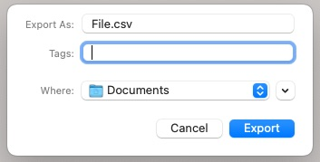
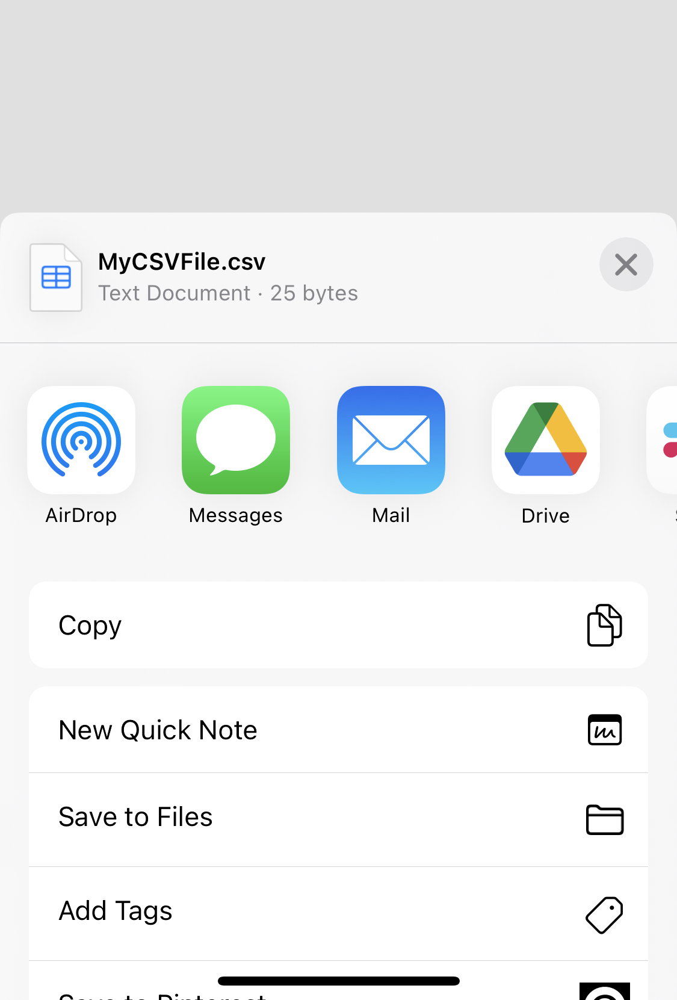

# Swift CSV Codable Package

This repository contains a simple , wrapped in a Swift Package.

It is made by **[SPACE SQUAD](https://www.spacesquad.de)**! We make great software with ♥️ in Berlin.


---

## Content
- [Features](#features)
- [Installation](#installation)
- [How to Use](#how-to-use)


## Features
- [x] Convert Codable-Objects to CSV-Content
- [x] Export and Save CSV Files 
- [ ] Import CSV Files and convert to Codable-Objects

---

## Installation
##### Requirements
- iOS 14.0+ / macOS 11.0+
- Xcode 13+
- Swift 5+

##### Swift Package Manager
In Xcode, go to `File > Add Packages` and add `https://github.com/hyperlink/swift-csv-codable`. Add the package to all your targets.
In the files you need any CSV-Capabilities add the import-Statement on top of your file:
```
import CSVCodable
```


## How to Use

This Package enables 

### Generate CSV Content

```Swift
public struct Person: Codable {
    let name: String
    let age: Int
}

let people: [Person] 

// fill array with content

let content = try? ExportManager.toCSV(people)

/**
"name;age
Jane;24
John;29"
*/

```

### Configuration
During the export process you might need some custom settings. For now all values are separated by semicolons and can be changed by initializing the `ExportManager` with a custom configuration object.

More customization options will be available in future releases.

```Swift
var config = ExportConfiguration()
config.delimiter = "," // Default: ";""
ExportManager.setup(config)
```


### Export and Save

```Swift
// Store in Document Directory

let content = try? ExportManager.toCSV(people)
ExportManager.saveInDocumentDirectory(data: content) { result in
    switch result {
        case .success(let url): 
            print("Saved successfully at \(url)")
        case .failure(let error): 
            print("Error: \(error.localizedDescription)")
    }
}


// Short style: Store in Document Directory
ExportManager.toCSVDocument(people) { result in
    switch result {
        case .success(let url): 
            print("Saved successfully at \(url)")
        case .failure(let error): 
            print("Error: \(error.localizedDescription)")
    }
}
```


#### SwiftUI

To save the generated file from your SwiftUI-App in the file system, you need to use the `fileExporter()`-Modifier and reference the generated `CSVDocument` by calling `ExportManager.toCSVDocument(:_)` 



```Swift
struct ContentView: View {
    @State private var document: CSVDocument?
    @State private var showExporter = false
    
    var body: some View {
        VStack {
            Button {
                let people: [Person]
                
                // fill array with content
                
                ExportManager.toCSVDocument(people) { result in
                    switch result {
                    case .success(let document): 
                        self.document = document
                        self.showExporter = true
                    case .failure(let error): 
                        print("Error: \(error.localizedDescription)")
                    }
                }
            } label: {
                Image(systemName: "square.and.arrow.up.circle.fill")
            }
        }
        .fileExporter(isPresented: $showExporter, document: document, contentType: .commaSeparatedText) { result in
            switch result {
            case .success(let url):
                print("Saved successfully at \(url)")
            case .failure(let error):
                print("Error: \(error.localizedDescription)")
            }
        }
    }
}
```


#### UIKit

For sharing and saving the file in your UIKit-App, you can use our `.share(:_)`-Function from any `UIViewController`. It creates and opens automatically an `UIActivityViewController`.



```Swift
class ViewController: UIViewController {

    func exportCSV() {
        let people: [Person]

        // fill array with content
        
        ExportManager.saveAsCSV(people, fileName: "MyCSVFile.csv") { result in
            switch result {
            case .success(let url):
                print("Saved successfully at \(url)")
                // Open ActivityViewController
                ExportManager.share(url: url, viewController: self) {
                    // ShareSheet was closed
                }
            case .failure(let error):
                print(error.localizedDescription)
            }
        }
    }
}
```